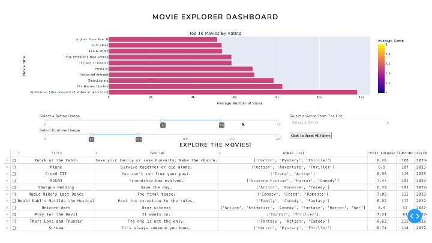

# movie_DASHboard

## App Overview

"Lights, camera, action! Get the full movie experience at your fingertips with the movie DASHboard app. Find the movies, read the synopsis, and get watching without wasting time scrolling through endless menus. Lights, camera, [open the app now!](https://movie-dashboard.onrender.com)"

The proposal for this project can be found [here](PROPOSAL.md).

## App Description

Using the movie DASHboard app is simple an intuitive. Use the rating a runtime sliders to select the desired range of movies that you would like to consider. Pick a genre to filter your results to your liking. The bar chart at the top of the app will display the top 10 movies based on the selections you have made. Hover your mouse over a given title to see more details such as the synopsis, revenue, and total number of votes. the bottom of the app contains a filterable data table that contains all the other movies that fit your filtering criteria.

## Usage Demo

## Contact us

If you would like to help with the development of this Dash app feel free to reach out after referring to the [contributing guidelines](CONTRIBUTING.md)

## License

Licensed under the terms of the [MIT license](LICENSE).
